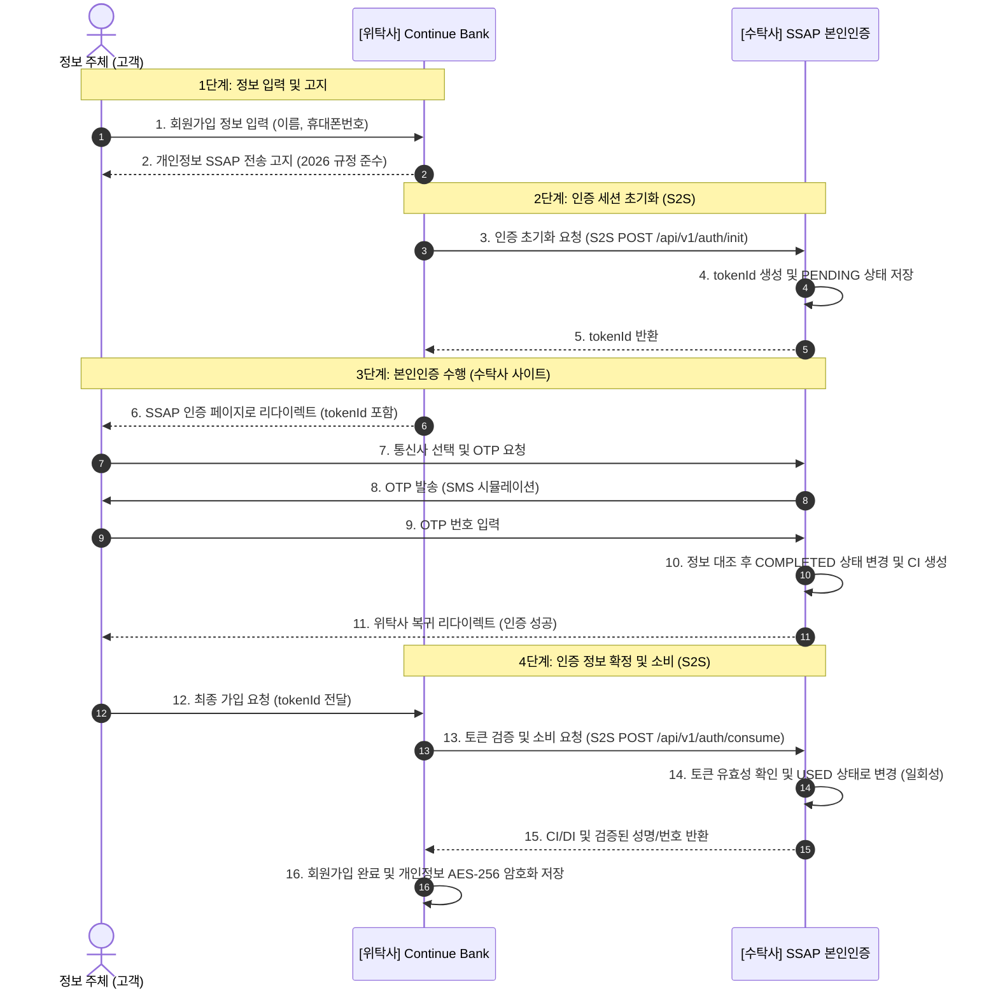

# 개인정보 처리 및 인증 토큰(JWT/Token) 흐름 가이드 (2026)
> "데이터의 흐름은 투명하게, 보안은 완벽하게."

본 문서는 본인인증 수탁사(SSAP)와 은행 위탁사(Continue Bank) 간의 **개인정보 처리 흐름** 및 **JWT/Token 기반 인증 방식**에 대한 기술적 이해를 돕기 위해 작성되었습니다.

---

## 1. 🔄 개인정보 데이터 처리 흐름도

전체 플랫폼에서 개인정보가 어떻게 수집되고, 전승되며, 파기되는지에 대한 흐름입니다.

---

## 2. 🔑 인증 토큰 및 메커니즘

2026년 금융 보안 가이드라인에 따른 **'간접 전송 방식'** 및 **'토큰 소비 모델'** 상세 내용입니다.

### 2.1 주요 기술 개념
| 개념 | 역할 | 보안상 이점 |
| :--- | :--- | :--- |
| **토큰 ID (UUID)** | 인증 세션의 고유 식별자 | 개인정보(PII)를 URL이나 프론트엔드에 직접 노출하지 않음. |
| **S2S (Server-to-Server)** | 백엔드 간 서버 직접 통신 | 클라이언트 측의 데이터 위변조 공격을 원천 차단. |
| **일회성 소비 (USED)** | 토큰 일회성 사용 보장 | 이미 사용된 토큰은 즉시 무효화하여 재사용 공격을 방지. |
| **CI (연계정보)** | 서비스 간 고유 식별 키 | 주민번호 노출 없이 서로 다른 서비스 간 동일인 여부 확인 가능. |

### 2.2 인증 토큰 상태 변화
`trustee_db.auth_token` 테이블의 `status` 필드 관리 기준

| 상태 (Status) | 시점 | 설명 |
| :--- | :--- | :--- |
| `PENDING` | 위탁사가 인증 시작 시 | 세션이 생성되었으나 아직 본인 확인 전인 상태. |
| `COMPLETED` | 수탁사 웹에서 인증 성공 시 | OTP 확인이 완료되어 유효한 인증 정보를 가진 상태. |
| `USED` | 위탁사 백엔드가 최종 확인 시 | **최종 사용 완료**. 해당 토큰으로 더 이상 정보 조회 불가. |
| `EXPIRED` | 3분 경과 또는 시도 초과 | 보안을 위해 해당 인증 세션이 폐기된 상태. |

---

## 3. 💾 데이터베이스 명세 (컴플라이언스 맵핑)

인증 및 개인정보 처리에 핵심적인 테이블 구조입니다.

### [수탁사 저장] `trustee_db.auth_token`
본인인증의 '증거'와 '상태'를 관리하는 휘발성(TTL 적용) 테이블입니다.
| 컬럼명 | 설명 | 보안 비고 |
| :--- | :--- | :--- |
| `token_id` | 인증 세션 고유 키 | UUID 형식, 프론트엔드 노출 가능 |
| `client_data` | 입력된 휴대폰 번호 | **AES-256 암호화** 저장 |
| `ci / di` | 연계정보 / 중복가입확인정보 | 고유 해시값 생성 (복호화 불가) |
| `status` | 인증 진행 상태 | PENDING → COMPLETED → USED |
| `retry_count` | 인증 시도 횟수 | 5회 초과 시 보안 폐기 |

### [위탁사 저장] `entrusting_db.site_users`
고객의 개인정보와 인증 결과를 보관하는 원장 테이블입니다.
| 컬럼명 | 설명 | 보안 비고 |
| :--- | :--- | :--- |
| `name` | 고객 성명 | **AES-256 암호화** 저장 |
| `phone_number` | 연락처 | **AES-256 암호화** 저장 |
| `ci` | 연계정보 (고유 식별값) | SSAP로부터 S2S로 전달받아 암호화 저장 |
| `is_verified` | 본인인증 완료 여부 | `true` 상태인 사용자만 금융거래 허용 |

---

## 🛡️ 2026 보안 체크포인트

1. **무상태(Stateless) 검증**: 수탁사는 위탁사의 요청(S2S)이 있을 때만 최소한의 정보를 제공합니다.
2. **복호화 최소화**: 모든 개인정보는 DB에 암호화 보관되며, 전송 직전 또는 본인 확인 단계에서만 일시적으로 복호화됩니다.
3. **감사 로그(Audit Trail)**: 모든 토큰 소비 이력은 `[COMPLIANCE-AUDIT]` 로그로 기록되어 사후 추적이 가능합니다.
