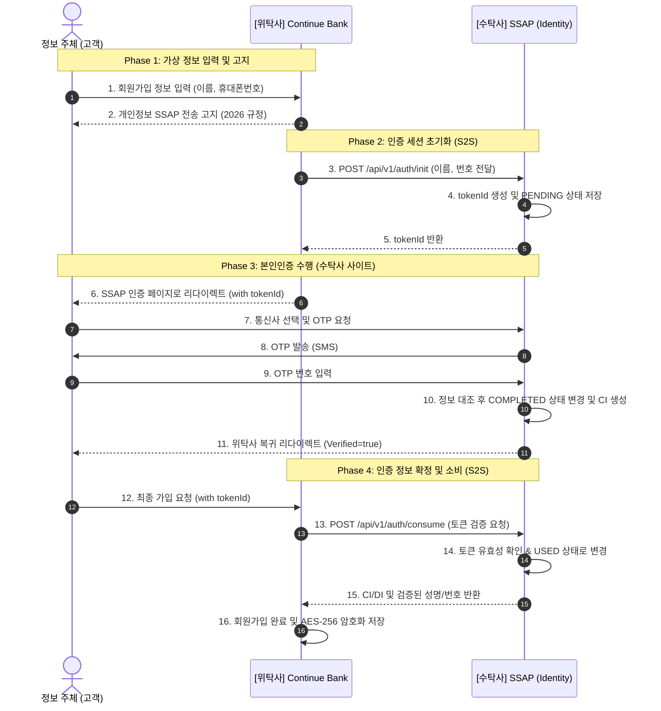

# Personal Information & JWT Auth Flow Guide (2026)
> "데이터의 흐름은 투명하게, 보안은 완벽하게."

본 문서는 본인인증 수탁사(SSAP)와 은행 위탁사(Continue Bank) 간의 **개인정보 처리 흐름** 및 **JWT/Token 기반 인증 방식**에 대한 기술적 이해를 돕기 위해 작성되었습니다.

---

## 1. 🔄 개인정보 데이터 처리 흐름도 (Data Processing Flow)

전체 플랫폼에서 개인정보가 어떻게 수집되고, 전공되며, 파기되는지에 대한 흐름입니다.

---

## 2. 🔑 JWT 및 Token 인증 메커니즘 (Auth Logic)

2026년 금융 보안 가이드라인에 따른 **'간접 전송 방식'** 및 **'Token 소비 모델'**에 대한 상세 내용입니다.

### 2.1 주요 기술 개념
| 개념 | 역할 | 보안상 이점 |
| :--- | :--- | :--- |
| **Token ID (UUID)** | 인증 세션의 고유 식별자 | PII(개인정보)를 URL이나 프론트엔드에 직접 노출하지 않음. |
| **S2S (Server-to-Server)** | 백엔드 간 통신 | 클라이언트 측의 데이터 위변조 공격을 원천 차단. |
| **One-time Consume** | 토큰 일회성 소비 | 한 번 사용된 인증 정보는 즉시 무효화되어 재사용 공격 방지. |
| **CI (Connecting Info)** | 연계정보 (고유 키) | 개인정보 노출 없이 서비스 간 동일인 여부 확인 가능. |

### 2.2 인증 토큰 상태 변화표
`trustee_db.auth_token` 테이블 내 `status` 필드 변화

| 상태 (Status) | 시점 | 설명 |
| :--- | :--- | :--- |
| `PENDING` | 위탁사가 인증 시작 시 | 세션이 생성되었으나 아직 본인 확인 전임. |
| `COMPLETED` | 수탁사(SSAP) 웹에서 인증 완료 시 | OTP 확인이 완료되어 유효한 인증 상태임. |
| `USED` | 위탁사 백엔드가 검증/소비 완료 시 | **최종 단계**. 더 이상 이 토큰으로 정보를 조회할 수 없음. |
| `EXPIRED` | 3분 경과 또는 시도 횟수 초과 | 보안을 위해 세션이 폐기됨. |

---

## 3. 💾 데이터베이스 명세 (Compliance Mapping)

인증 및 개인정보 처리에 핵심적인 테이블 구조입니다.

### [수탁사 저장] `trustee_db.auth_token`
본인인증의 '증거'와 '상태'를 관리하는 휘발성 테이블입니다.
| 필드 | 설명 | 비고 |
| :--- | :--- | :--- |
| `token_id` | 인증 세션 키 | UUID 형식, 프론트엔드 노출용 |
| `client_data` | 입력된 휴대폰 번호 | **AES-256 암호화** 저장 |
| `ci / di` | 연계정보 / 중복가입확인정보 | 인증 완료 시 생성 (복호화 불가) |
| `status` | 인증 진행 상태 | PENDING → COMPLETED → USED |
| `retry_count` | 인증 시도 횟수 | 5회 초과 시 강제 폐기 |

### [위탁사 저장] `entrusting_db.site_users`
최종적으로 확정된 개인정보를 보관하는 원장 테이블입니다.
| 필드 | 설명 | 비고 |
| :--- | :--- | :--- |
| `name` | 성명 | **AES-256 암호화** 저장 |
| `phone_number` | 연락처 | **AES-256 암호화** 저장 |
| `ci` | 연계정보 | SSAP로부터 S2S로 전달받아 저장 |
| `is_verified` | 인증 여부 | `true` 상태만 금융거래 가능 |

---

## 🛡️ 2026 보안 체크포인트 (Security Check)

1. **무상태(Stateless) 검증**: 수탁사는 위탁사에게 데이터를 직접 주지 않고, 위탁사가 '검증'을 요청할 때만 S2S로 정보를 넘깁니다.
2. **복호화 최소화**: 모든 개인정보는 DB에 암호화되어 저장되며, S2S 통신 직전 또는 본인 확인 단계에서만 일시적으로 복호화됩니다.
3. **Audit Trail**: 모든 토큰의 소비 이력은 `[COMPLIANCE-AUDIT]` 로그로 기록되어 사후 추적이 가능합니다.
