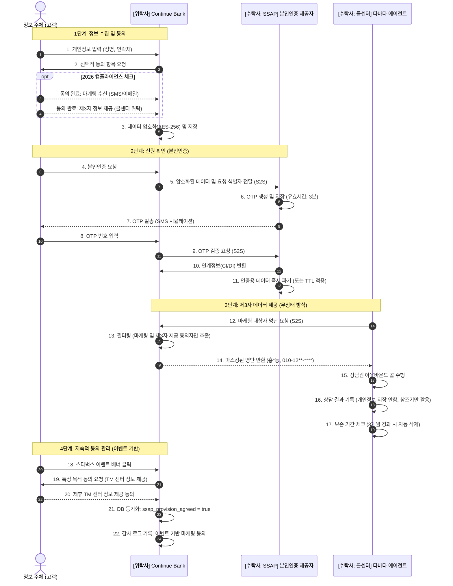

# 개인정보 처리 흐름도 (2026 컴플라이언스 기준)
> "금융의 중단 없는 흐름, 보안은 계속됩니다."

이 문서는 2026년 금융 데이터 보안 규정을 엄격히 준수하여 설계된 Continue Bank 생태계의 개인정보 처리 흐름을 상세히 기록합니다.

---

## 📜 핵심 준수 원칙 (2026 규정 적용)

| 원칙 | Continue Bank 구현 내용 |
| :--- | :--- |
| **세분화된 동의** | 마케팅 동의를 **SMS, 이메일, 푸시**로 분리하고, 제3자 제공 동의를 서비스 이용과 **별도로** 관리합니다. |
| **데이터 최소화** | 콜센터 상담원은 **마스킹된 데이터**만 열람 가능하며, 상담 시스템 DB에는 개인정보를 직접 저장하지 않습니다. |
| **잊혀질 권리 (TTL)** | 인증 토큰(SSAP)은 **3분 후 자동 파기**되며, 콜 상담 이력은 **3개월** 보관 후 삭제됩니다. |
| **설명 요구권** | 정보 수집 전 "자격 증명을 통한 자산 보호" 등 수집 목적을 사용자 화면에 명확히 고지합니다. |
| **설계에 의한 안전** | 모든 개인정보(이름, 번호)는 저장 시 **AES-256 암호화**를 적용하고 백엔드 서버 간(S2S) 통신만 허용합니다. |

---

## 🔄 개인정보 데이터 처리 흐름도

---

## 🛡️ 기술적 구현 세부 사항

### 1. 암호화 (AES-256)
위탁사(`site_users`)와 수탁사(`auth_token`)의 모든 민감 컬럼은 `javax.crypto` 패키지를 사용해 프로젝트 공통 키로 암호화됩니다.
*   **키 관리**: 환경 변수(`ENCRYPTION_KEY`)를 통해 중앙 집중 관리.
*   **대상**: 성명(`name`), 연락처(`phone_number`).

### 2. S2S 통신 보안
위탁사 클라이언트와 콜센터/SSAP 간의 모든 통신은 보호됩니다.
*   **인증**: API 호출 시 `X-Service-Token` 헤더를 필수값으로 요구합니다.
*   **IP 화이트리스트**: 인가된 컨테이너 IP의 요청만 수락하도록 시뮬레이션된 서비스 로직이 적용되어 있습니다.

### 3. 감사 로그 (부인 방지)
개인정보에 접근(조회/수정)하는 모든 행위는 `access_log` 테이블에 기록됩니다.
*   **주체**: 상담원 ID 또는 사용자 ID
*   **일시**: 접근 타임스탬프
*   **사유**: 액션 코드 (예: `VIEW_360`, `SEARCH_MEMBER`)
*   **투명성**: 정보 주체(고객)는 '마이페이지'에서 본인의 정보 접근 기록을 열람할 수 있습니다.

---

## ⚖️ 법적 매핑 (대한민국 개인정보보호법 기반)

*   **제15조 (수집·이용)**: 필수 vs 선택 항목의 명확한 분리를 통해 준수.
*   **제17조 (제3자 제공)**: `third_party_provision_agreed` 필드를 통한 명확한 거절 권리 보장.
*   **제21조 (파기)**: 파기 스케줄러를 통한 자동 삭제(수탁사 3분, 콜센터 3개월).
*   **제29조 (안전조치)**: AES-256 암호화 및 접근 제어 통제 적용.
